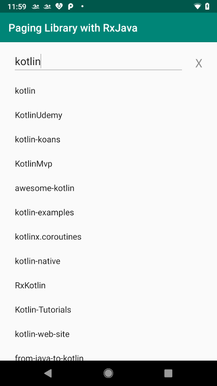

## Github Client Android sample showing instant search and pagination using the Android Jetpack Architecture components Paging Library and LiveData.  As well as Retrofit2 and RxJava.

# RepoViewModel

- Initializes the Data Source Factory.

- Initializes the LiveData objects that communicate back to the main activity including the PagedList. 

- Initializes the RxJava chains: one for the initial request and a second for the pagination request.

- Initializes Retrofit2 and the Github Service API.

- Fetches the Github Repo data.

# RxJava

## Initiator - PublishSubject

- Debounce: The debounce operator is used with a time constant. The debounce operator handles the case when the user types “a”, “ab”, “abc”, in a very short time. So there will be too much network calls. But the user is finally interested in the result of the search “abc”. So, you must discard the results of “a” and “ab”. Ideally, there should be no network calls for “a” and “ab” as the user typed those in very short time. So, the debounce operator comes to the rescue. The debounce will wait for the provided time for doing anything, if any other search query comes in between that time, it will ignore the previous item and start waiting for that time again with the new search query. If nothing new comes in that given constant time, it will proceed with that search query for further processing. So, debounce only emit an item from an Observable if a particular timespan has passed without it emitting an another item.

- Filter: The filter operator is used to filter the first two characters to avoid unnecessary network calls.

- DistinctUntilChanged: The distinctUntilChanged operator is used to avoid the duplicate network calls. Let say the last on-going search query was “abc” and the user deleted “c” and again typed “c”. So again it’s “abc”. So if the network call is already going on with the search query “abc”, it will not make the duplicate call again with the search query “abc”. So, distinctUntilChanged suppress duplicate consecutive items emitted by the source Observable.

- SwitchMap: The switchMap operator is used to avoid the network call results which are not needed more for displaying to the user. Let say the last search query was “ab” and there is an ongoing network call for “ab” and the user typed “abc”. Then you are no more interested in the result of “ab”. You are only interested in the result of “abc”. So, the switchMap comes to the rescue. It only provides the result for the last search query(most recent) and ignores the rest.

## Paginator - Flowable

- BackpressureDrop: The backpressureDrop operator is used to drop requests if it can't handle more than it's capacity 128 requests

- ConcatMap - To concatenateMap operator is used to handle the output of multiple observables to act like a single observable and preserves the order of the requests.
  

## Screenshot

## License

Copyright 2018 Brian Lichtenwalter

Licensed to the Apache Software Foundation (ASF) under one or more contributor license agreements. See the NOTICE file distributed with this work for additional information regarding copyright ownership. The ASF licenses this file to you under the Apache License, Version 2.0 (the "License"); you may not use this file except in compliance with the License. You may obtain a copy of the License at

http://www.apache.org/licenses/LICENSE-2.0

Unless required by applicable law or agreed to in writing, software distributed under the License is distributed on an "AS IS" BASIS, WITHOUT WARRANTIES OR CONDITIONS OF ANY KIND, either express or implied. See the License for the specific language governing permissions and limitations under the License.

